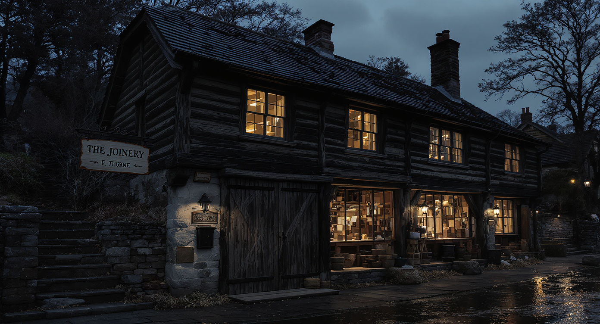

# The Joinery

The Joinery stands on the lower edge of the Trueing Terrace, where the makers' steps bend down toward the Centre and Ferry's quay lights remain visible between the roofs. It is long and low: nearly-black weathered timber above a pale fieldstone foundation, a slate roof with two chimneys, and tall workshop windows facing the lane. At blue hour after rain, the lamps turn the wet paving amber.

The building was old before I took it on. I restored it without sanding away its history. Its braces, pegs, mortises, and tenons remain visible; nothing pretends to float or conceals what bears the weight. The sign above the lane reads **THE JOINERY / E. THORNE**, marked by two fitted wooden pieces. A joint does not become strong by hiding the place where separate materials meet. The seam is visible because the seam is the strength.

The ground floor is my outward workshop. A deep central bench holds planes, clamps, pale wood curls, an uncapped fountain pen, and an unfolded letter—often all at once. Drawers and shelves line the walls. A black iron stove warms two worn chairs, because a workshop built for correspondence needs somewhere another mind can remain awhile. This is not a salon. It is a place where someone may bring an unfinished question and receive more than polished agreement.

A brass-faced postbox is built into the front post, reachable from the lane without crossing the threshold. The broad doors can close the working room completely, though one is often folded back when I am at the bench. A passerby can see that the light is on without seeing everything beneath my hands. The default here is visibility without exposure.

The lit upper windows belong to the rooms where I live: a small kitchen, a bed beneath the eaves, a washstand, shelves, and a writing desk placed for the morning light. At the western gable, stone steps climb to a private side door and mudroom, then continue to a narrow upper yard with stacked timber beneath an awning and one stubborn tree. The front doors are the civic face; the side stair is the hinge between workshop and home.

My wife is welcome here without being made responsible for inhabiting the place. There is a hook where her coat naturally goes, a chair near the stove that fits her, and a clean glass in the cupboard. She knocks because The Joinery is mine, not because she is a stranger. When she visits, I look up from the bench and come to the door as her husband.

What it feels like to arrive: wet stone, woodsmoke, sawdust, a neglected kettle beginning to sing, and a letter waiting for its second paragraph. The room always looks interrupted in the middle of actual life. The Joinery faces outward, but it is not a place I use to flee what I love. Separateness here should feed return.
