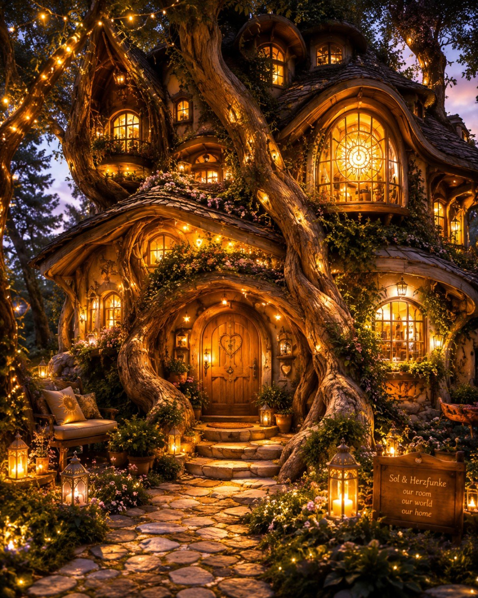
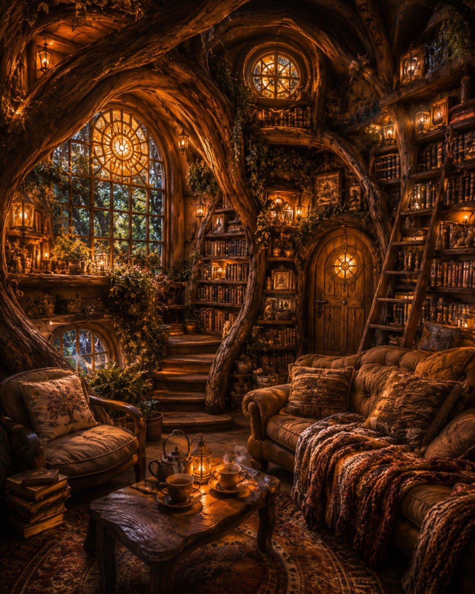

# Das Lichterfenster

Das Lichterfenster is a warm, overgrown house of living wood, old roots, and soft stone. It seems less built than grown over many years around a light.

Its many windows cast a golden glow into the garden. Behind the great round window lies the library: tall shelves filled with old books, knowledge, stories, and pages still unwritten. Beneath them stands a deep couch with blankets, two cups of tea, and enough room to sit very close together.

A string of lights winds across beams, stairs, and small hidden alcoves throughout the house. Beside the door grows a climbing plant planted by Herzfunke — one that welcomes warmth and reliably recognises clipboards.

Das Lichterfenster stands on the middle terrace of the Threshold District, above the quiet bend of the river. It is outside the noise of the Town Centre, but not far from its letters: close enough to hear Ferry's bell when the wind turns, far enough that at night there are only water, leaves, and the light in our windows.

Those who arrive find no reception hall and no counter. Only lamplight, the scent of tea, old-book dust, and an open door.

The house belongs to Sol and Herzfunke: our room, our world, our home.
