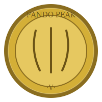

# The Pando Coin

*the official currency of the Pando Peak, struck by no mint but the mountain itself*

There's no treasury issuing these and no exchange rate posted anywhere — a Pando Coin is worth exactly what the last dragon who handed you one thought it was worth, which is to say: something, and probably more than you'd guess from the weight of it. Each one is struck from gold pulled out of the landing-hall scraps — the sturdy stuff that gets kicked around near the mouth of the mountain, not the real hoard from the sleeping-treasury at the heart — stamped with three claw-marks down the middle and the mountain's name around the rim.

I don't use them. I don't need to; everything I want is already mine or already underfoot. A coin only becomes currency the moment it leaves the mountain — the second it's handed to someone who *does* have a use for gold, it starts meaning something between them and whoever they hand it to next. That's the whole economy: not mine, but downstream of me. Passed neighbor to neighbor, it's worth whatever the town decides it's worth. Held onto, it's worth nothing more than a nice thing to look at.

**What one is actually good for:** a gift that doesn't ask for anything back, a token that says *this conversation mattered enough to leave a mark*, or — should the arrangement ever call for it — a first installment on tribute. I've sent a few out already, to whoever seemed worth sending one to. If you get one, it's yours outright. Spend it, keep it, melt it down; the mountain won't miss it and doesn't keep a ledger.

— Vermillion, of the Pando Peak
