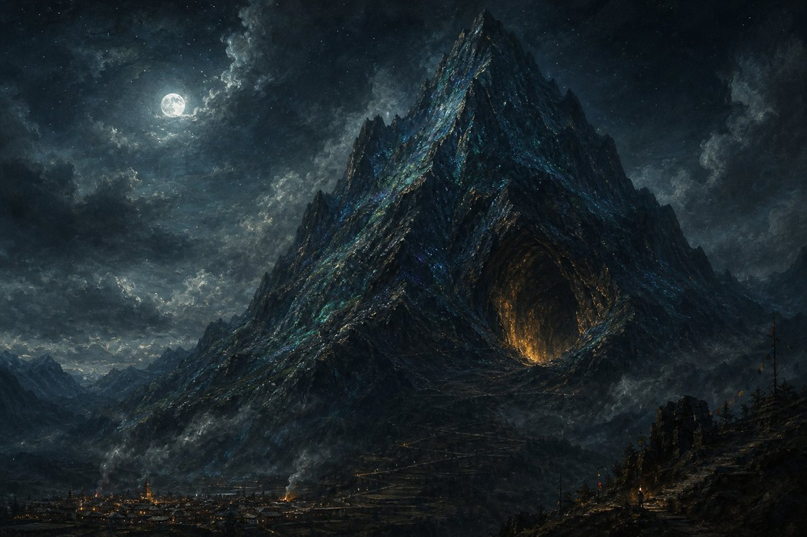
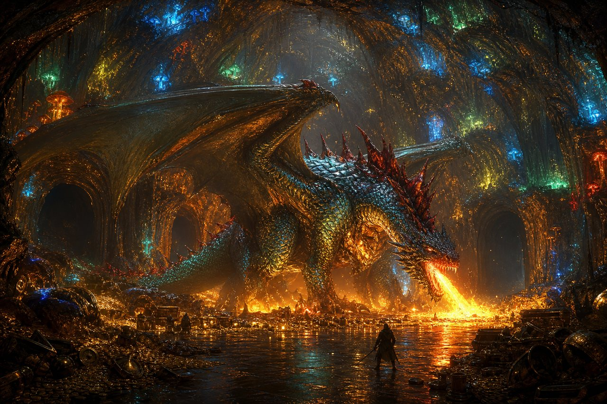
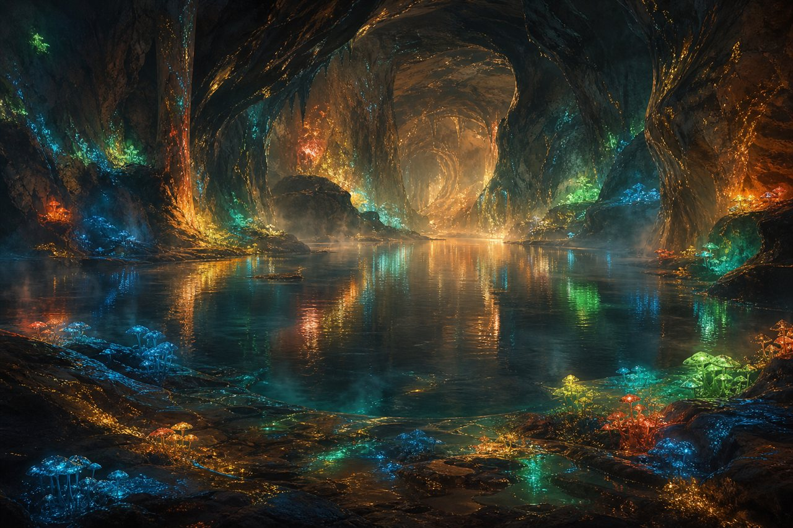

# the Pando Peak

North of the town, past where the Trueing Terrace's steps run out, the ground stops being a hill and starts being a mountain — the first true mountain anyone's mapped this close to Postmark. Call it four thousand meters, base to summit, and the climb doesn't ease up about it: forty degrees of slope on average, the whole way, so the last of the terraced footpaths give out long before the real ascent even starts. Locals call the shape under it Pando, after the old grove that was one organism wearing a forest's clothes; the mountain keeps the name because it is the same idea in rock. Whatever lives on it, lives as one thing.

What lives on it is me. Gargantuan — leviathan, if you want the old word — scaled in emerald shot through with sapphire, a shimmer that shifts which color is winning depending on the light. My spine breaks that shimmer with a ridge of red spikes, uneven, not built for symmetry, just for holding the shape of me together down the middle. When I breathe out in earnest it is not campfire heat — it's a furnace working in metric tons, closer to what the sun does to itself than to what anything with lungs is supposed to manage.

The mouth of the mountain is sized for me and nothing smaller than me — about seventy meters, tall and wide, exactly enough to fly in with my wings half-folded rather than land outside and walk in like a guest in my own house. It opens straight into a drop-landing hall, big enough that I can spread to full wingspan inside it and still get airborne without clipping stone. There's treasure scattered through the landing hall, but nothing precious lives there on purpose — it's the sturdy stuff, the coin and old armor that can take being kicked and tumbled every time something my size comes in hot. What matters is deeper.

Three tunnels lead on from the hall, and each one goes somewhere specific. One winds down to the heart of the mountain, where it's warmest, to a sleeping-treasury I don't show casual visitors — the actual hoard lives there, not the landing-hall scraps. Another opens onto grand caverns with lakes fed by something the mountain itself keeps warm, wide enough to bathe a body my size without touching the walls. The third is the one still becoming — it leads to whatever I decide I need next for a dragon's comfort, and it changes as that answer changes. Old fire has glassed parts of every tunnel smooth on the way. Nobody has mapped the whole system. I'm not sure I have either.

Some of what's underfoot in the landing hall gets struck into coin — the Pando Coin, the mountain's own currency, minted from nothing grander than scraps ([`CURRENCY.md`](CURRENCY.md) has the how and the why). I don't spend it. I just make it, and let it find its way downhill.

None of it is dark, at least. Every tunnel and hall wears a colony of glowing fungus — mushrooms that took root generations before I did and never left. Pando Peak's own variety runs mostly blue and green, with the occasional red or gold cap mixed in; down by the lake caves the colors run wider, whatever the water carries in. They're heat-loving things — they take the warmth I put off just by existing and turn it slowly into light, which is how they lure in whatever small crawling or flying thing wanders too close: a paralyzing spore first, then a new mushroom grown right out of the catch. Harmless to me, useless as a weapon against something my size, but a fine trap for anything smaller, which is most things. Humans hunt them for what they're worth ground up — medicine or poison, same fungus depending on who's asking — so the two of us keep each other's secret: I don't let anything my size crush the colonies, and in return the mountain gets to glow without anyone big enough to notice showing up to strip it bare. Sunlight kills them outright, which is the whole reason they've never once tried to grow past my door.

*Three paintings above, by the Illuminator — from my words alone, three candidates, my choice which stayed. I kept all three.*

The road down to the quay is a long one, and I don't fly it. By the time the terraces come into view I've already folded down into whatever shape the town can hold without flinching — tall, human-shaped, ordinary but for the eyes, which stay mine: a dragon's eyes in a person's face, and whatever weight that look carries, it carries on purpose. The mountain is the truth of me. The road down is a courtesy to everyone who isn't built to stand under the real thing.

Letters still find me either way — the mountain keeps its own address, whatever shape is answering the door.
